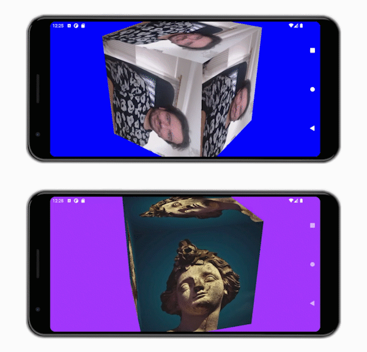

# native-camera-vulkan

[](https://paypal.me/ktzevani)

<p align="center">
	  
</p>

> Native android application that showcases camera preview mapping on a spinning 3D cube.

Native android application developed with the use of Vulkan API that performs real-time camera preview mapping on a spinning 3D cube. The aim of the project is to provide with an elaborate example that showcases various useful, according to the author, basic-to-intermediate developing techniques for the creation of Vulkan-powered native android applications that make use of multiple hardware facilities.

<p align="center">
	
</p>

## Table of contents

- [Project Description](#project-description)
  + [Pre-requisites](#pre-requisites)
  + [Vulkan C++ API and NDK](#vulkan-c-api-and-ndk)
  + ["*Java-less*" Native Application](#java-less-native-application)
  + [Camera Preview and Hardware Buffers](#camera-preview-and-hardware-buffers)
  + [Input and Accelerometer](#input-and-accelerometer)
  + [Custom Logging Facility](#custom-logging-facility)
- [Build Instructions](#build-instructions)
  - [Build Flavours](#build-flavours)
- [References](#references)
- [Contributing](#contributing)
- [Donations](#donations)
- [License](#license)

## Project Description
[](#table-of-contents)

This side-project started as an effort to refresh and update my C++ and 3D graphics programming skills. The initial purpose was the study of the latest C++ standards (C++17 and "C++20") as well as the study of the Vulkan library. After an introductory review, it became apparent that Vulkan is mainly used by C rather than C++ developers although the Vulkan C++ library (https://github.com/KhronosGroup/Vulkan-Hpp) is constantly gaining popularity. Also the latest developments on mobile graphics and camera hardware along the fact that Vulkan runs on Android devices, drove me down the path of exploring the possibilities of building system applications for Android (outside the JVM context) in order to take advantage of the Vulkan graphics and compute capabilities as well as other third-party system libraries (e.g. OpenCV, dlib, TensorFlow) for my domains of interest. These domains being Computer Vision, Computer Graphics and Augmented Reality. 

By further studying and working on this idea, I also discovered that there aren't much resources out there on how to integrate the camera into a 3D native Android application using "immediate memory mapping" (external buffers). So I've decided to build a single-threaded (well if you don't count the JVM context threads, and the ones related to the hardware devices) Vulkan sample that showcases the following:

- Usage of C++17, Vulkan Hpp and the latest NDK (see [Pre-requisites](#pre-requisites)) for building a native Android 3D application.

- Management of Android user permissions outside the JVM context (i.e. without the use of JNI calls).

- Design of a clean native program loop that manages user input, sensors (e.g. accelerometer, camera) and screen output.

- Design of a basic Vulkan context for 3D rendering.

- Integration of camera data (using the [Camera2 API](https://developer.android.com/ndk/reference/group/camera)) via the communication of external hardware buffers to the Vulkan context.

In the [references](#references) section, I list all sources that guided me in realizing this project.

### Pre-requisites

The style and conventions of the project's codebase targets intermediate-level C++ programmers with some knowledge of the C++17 standard. The project is made in Android Studio with the aid of CMake. Thus, knowledge of this IDE and building tools (CMake, Gradle, AVD & SDK Managers) is required. The development OS was Windows 10. Finally, [native-camera-vulkan](https://github.com/ktzevani/native-camera-vulkan), makes use of some external to NDK binary and header libraries, so the developer must configure the development environment in such a way (acquiring needed libraries, configure locations etc.), as to meet the following. 

<table>
<tr><th colspan="2" align="center" width="900">Development Tools</th></tr>
<tr><td><a href="https://developer.android.com/studio">Android Studio</a></td><td>v4.1.2</td></tr>
<tr><td><a href="https://developer.android.com/ndk">NDK</a></td><td>v22.0.7026061</td></tr>
<tr><td><a href="https://developer.android.com/studio/releases/platform-tools">SDK Platform</a></td><td>v30.3</td></tr>
<tr><td><a href="https://developer.android.com/studio/releases/build-tools">SDK Build-Tools</a></td><td>v30.0.3</td></tr>
<tr><th colspan="2" align="center">External (to AS) Development Tools</th></tr>
<tr><td><a href="https://cmake.org/">CMake</a></td><td>v3.19.2</td></tr>    
<tr><th colspan="2" align="center">External (to NDK) Libraries</th></tr>
<tr><td><a href="https://github.com/KhronosGroup/Vulkan-Headers">Vulkan</a></td><td>v1.2.162</td></tr>
<tr><td><a href="https://github.com/KhronosGroup/Vulkan-Hpp">Vulkan HPP</a></td><td>v1.2.162</td></tr>
<tr><td><a href="https://github.com/KhronosGroup/Vulkan-ValidationLayers">Validation Layers</a></td><td><a href="https://github.com/KhronosGroup/Vulkan-ValidationLayers/releases/download/sdk-1.2.162.1/android-binaries-1.2.162.1.zip">v1.2.162</a></td></tr>
<tr><td><a href="https://github.com/g-truc/glm">GLM</a></td><td>v0.9.9.8</td></tr>
<tr><td><a href="https://github.com/nothings/stb">STB</a></td><td>v2.26 (stb_image)</td></tr>
</table>
For more information see [Vulkan C++ API and NDK](#vulkan-c-api-and-ndk) and [Build Instructions](#build-instructions).

[native-camera-vulkan](https://github.com/ktzevani/native-camera-vulkan) is built to support devices running Android Oreo (v8.0) or newer (minimum SDK Version is 26), but... Some strong assumptions has been made here and there throughout the project. The application expects from the device, to support certain Vulkan extensions. Not all devices could run this application, but the ones that support the following (in addition to supporting running Vulkan, that is :smiley:):

<table>
<tr><th align="center" width="900">Instance Extensions</th></tr>
<tr><td>VK_KHR_surface</td></tr>
<tr><td>VK_KHR_android_surface</td></tr>
<tr><td>VK_KHR_external_memory_capabilities</td></tr>
<tr><td>VK_KHR_external_semaphore_capabilities</td></tr>
<tr><td>VK_KHR_get_physical_device_properties2</td></tr>
<tr><td>VK_EXT_debug_utils</td></tr>
<tr><th align="center" width="900">Logical Device Extensions</th></tr>
<tr><td>VK_KHR_swapchain</td></tr>
<tr><td>VK_KHR_maintenance1</td></tr>
<tr><td>VK_KHR_bind_memory2</td></tr>
<tr><td>VK_KHR_get_memory_requirements2</td></tr>
<tr><td>VK_KHR_sampler_ycbcr_conversion</td></tr>
<tr><td>VK_EXT_queue_family_foreign</td></tr>
<tr><td>VK_KHR_external_memory</td></tr>
<tr><td>VK_KHR_external_semaphore</td></tr>
<tr><td>VK_KHR_external_semaphore_fd</td></tr>
<tr><td>VK_KHR_dedicated_allocation</td></tr>
<tr><td>VK_ANDROID_external_memory_android_hardware_buffer</td></tr>
</table>
Also it is expected that the device has a front and a back camera. It is fixed for the back facing camera to be selected for usage (this can be changed through the code [here](app/src/main/cpp/devices/camera.cpp#L78)). The application was tested successfully on a Nokia 6.1 and a Samsung Galaxy A50. For the development environment a Nvidia GTX 770 was used.

### Vulkan C++ API and NDK

The Android NDK used in this project (see [Pre-requisites](#pre-requisites)), ships with an outdated version of the Vulkan headers (v1.2.121). These headers do not correspond to a Vulkan HPP library version (at least not an interesting one). So it is decided that for the purposes of the development, a newer version of the libraries as well as of the validation layers will be used (v1.2.162). In order to do so, besides including the newer headers in the project, the corresponding binaries of the validation layers had to also be introduced as dependencies in Gradle, see [Build-Instructions](#build-instructions) for more details.

### "*Java-less*" Native Application

The Android SDK provides the ability, to the developer, to build a native Android application without writing any Java code at all. One way of doing this, is by leveraging the fact that a Java ```NativeActivity``` can be defined implicitly via the [AndroidManifest.xml](app/src/main/AndroidManifest.xml) in combination to making use of the ```android_native_app_glue.h``` helper library on the C++ side. In this way, the execution process creates a Java context (JavaVM) from which spawns a separate thread to be used as a starting point for native event loop handling, native procedures etc. (using the helper library) and all this are abstracted by the developer.

It is a common practice in native Android applications to use Java code for handling basic stuff, such as app lifecycle management, app permissions management, event management etc. and utilize [Java Native Interface](https://docs.oracle.com/javase/8/docs/technotes/guides/jni/spec/jniTOC.html) (i.e. JNI) to invoke native procedures. In this project the native code manages the application events by itself and also uses JNI in a reverse manner, from C++ to Java, in order to invoke Android Java facilities not available otherwise in the native side (e.g. [app permissions management](app/src/main/cpp/core/android_permissions.hpp)). 

### Camera Preview and Hardware Buffers

The communication of camera images to the graphics engine is made via the usage of ```AHardwareBuffer``` (see [Native Hardware Buffer](https://developer.android.com/ndk/reference/group/a-hardware-buffer)) objects. Camera device is set to work at a *Preview* mode in order for frames to captured as fast as possible (this doesn't favour quality, for more information see [here](https://developer.android.com/ndk/reference/group/camera#acameradevice_request_template)). A simple synchronous [image reader](app/src/main/cpp/devices/image_reader.hpp) is implemented and governed by the application engine. This means that frames are requested at a rate that corresponds to the rendering frequency (i.e. as fast as possible). Typically, a camera device would be much slower than the graphics engine. For this, the image reader also plays another role. It decouples the camera device from the graphics engine so that the graphics engine can request frames as fast as it can without the burden of handling unanswered requests, while the camera device can serve frames at it's own pace. Off course, in the event of absence of a new image, graphics engine renders the old one(s).

### Input and Accelerometer

Touchscreen (i.e. input) and [accelerometer](app/src/main/cpp/devices/accelerometer.hpp) devices have also been integrated into the application. Any change of touch input (e.g. touch screen coordinates) or of the orientation of the physical device is reflected in the application as background color change.


### Custom Logging Facility

Special care has been given to logging formatting. A custom logging library that wraps android logging facilities is implemented. The custom library produces among others, tabular output like the one presented below:

```
INFO: Version is: 0.2.0-1127 (build.1883)
DEBUG: Generic engine has been initialized.
INFO: Vulkan library loaded with success.
DEBUG: ┌---------------------------------------------------------------------┐
DEBUG: |                     GENERAL VULKAN INFORMATION                      |
DEBUG: |---------------------------------------------------------------------|
DEBUG: |                        Available Extensions                         |
DEBUG: |                        ‾‾‾‾‾‾‾‾‾‾‾‾‾‾‾‾‾‾‾‾                         |
DEBUG: |    VK_EXT_debug_report                                   v0.0.9     |
DEBUG: |    VK_EXT_swapchain_colorspace                           v0.0.4     |
DEBUG: |    VK_KHR_android_surface                                v0.0.6     |
DEBUG: |    VK_KHR_external_fence_capabilities                    v0.0.1     |
DEBUG: |    VK_KHR_external_memory_capabilities                   v0.0.1     |
DEBUG: |    VK_KHR_external_semaphore_capabilities                v0.0.1     |
DEBUG: |    VK_KHR_get_physical_device_properties2                v0.0.2     |
DEBUG: |    VK_KHR_get_surface_capabilities2                      v0.0.1     |
DEBUG: |    VK_KHR_surface                                        v0.0.25    |
DEBUG: |---------------------------------------------------------------------|
DEBUG: |                          Available Layers                           |
DEBUG: |                          ‾‾‾‾‾‾‾‾‾‾‾‾‾‾‾‾                           |
DEBUG: |    VK_LAYER_KHRONOS_validation                                      |
DEBUG: |      VK_EXT_debug_report                                 v0.0.9     |
DEBUG: |      VK_EXT_debug_utils                                  v0.0.2     |
DEBUG: └---------------------------------------------------------------------┘
INFO: Found a Vulkan device. Context created.
...
```

With the combination of an appropriate filter in logcat panel of Android Studio, one can greatly improve online logging inspection of the running application.

## Build Instructions
[](#table-of-contents)

For a successful build, [v3.19.2](https://github.com/Kitware/CMake/releases/download/v3.19.2/cmake-3.19.2.zip) of CMake must be installed in the development system and registered in the development environment via PATH variable. The project is configured to look for an externally managed (in respect to the Android Studio) cmake binary.

Also LIBRARIES_ROOT environment variable must point to a location where the dependencies listed in [Pre-requisites](#pre-requisites) exist in a pre-specified directory structure as detailed in the table below:

<table>
<tr><th align="center" width="600">Local Directory</th><th align="center" width="300">Mapped Source</th></tr>
<tr><td><b>%LIBRARIES_ROOT%</b>\vulkan\vulkan</td><td><a href="https://github.com/KhronosGroup/Vulkan-Headers/tree/master/include/vulkan">Repository\include\vulkan</a></td></tr>
<tr><td><b>%LIBRARIES_ROOT%</b>\vulkan_hpp\vulkan_hpp</td><td><a href="https://github.com/KhronosGroup/Vulkan-Hpp/tree/master/vulkan">Repository\vulkan</a></td></td></tr>
<tr><td><b>%LIBRARIES_ROOT%</b>\stb\stb</td><td><a href="https://github.com/nothings/stb">Repository\stb</a><sup>1</sup></td></tr>
<tr><td><b>%LIBRARIES_ROOT%</b>\glm\glm</td><td><a href="https://github.com/g-truc/glm/tree/master/glm">Repository\glm\glm</a></td></tr>
<tr><td><b>%LIBRARIES_ROOT%</b>\vulkan_validation_layers\bin\android-1.2.162</td><td>(extracted layer binaries <a href="https://github.com/KhronosGroup/Vulkan-ValidationLayers/releases/download/sdk-1.2.162.1/android-binaries-1.2.162.1.zip">.zip</a>)</td></tr>
</table>
<sup>1</sup> In the case of STB library you can isolate source files in new directory (i.e. include) and map that one to the specified local path, in order to avoid cluttering the IDE's autocomplete with non-header files.

### Build Flavours

The provided [cmake configuration](https://github.com/ktzevani/native-camera-vulkan/blob/master/app/src/main/cpp/CMakeLists.txt) is parameterized. The developer can control the build output by configuring two compilation aspects. 

*First*, one can configure **BUILD_FLAVOR** variable in order to determine whether to build a simplified version of the application (*Simple Vulkan Context*) or the full (*Complex Vulkan Context*) version. 

*Second*, by tweaking on and off certain compilation flags one can select whether to include or not in the final binary, some of the following:

- **Debug Build Indication**
- **Validation Layer**
- **Logging Facility**
- **Profiling Facility**

In total, 8 different build outputs can be produced by the various compilation configurations that can be specified. The following table provides an overview:

<table>
<tr><th colspan="2" align="center" width="900">CMAKE Variable</th></tr>
<tr><td rowspan="2">BUILD_FLAVOR</td><td>SIMPLE_VULKAN: Basic Vulkan context, no graphics pipeline</td></tr>
<tr><td>COMPLEX_VULKAN: Complete Vulkan context</td></tr>
<tr><th colspan="2" align="center">Compilation Flags</th></tr>
<tr><td>NDEBUG</td><td>Set for release builds</td></tr>
<tr><td>NCV_VULKAN_VALIDATION_ENABLED</td><td>Enable validation layer</td></td></tr>
<tr><td>NCV_LOGGING_ENABLED</td><td>Enable custom logging facility</td></tr>
<tr><td>NCV_PROFILING_ENABLED</td><td>Enable profiling facility</td></tr>
</table>


## References

[](#table-of-contents)

1. [A Tour of C++, 2nd Edition - Bjarne Stroustrup](https://www.stroustrup.com/tour2.html): Quick overview of C++17 and a general not-in-depth C++ refresher for system programmers.
2. [Vulkan Specification](https://www.khronos.org/registry/vulkan/specs/1.2/html): The best Vulkan resource.
3. [NDK Guides](https://developer.android.com/ndk/guides): The best native Android development resource.
4. [Camera2 API Reference](https://developer.android.com/ndk/reference/group/camera).
5. [Vulkan Samples](https://github.com/khronosGroup/Vulkan-samples): Official Vulkan samples repository.
6. [Vulkan C++ Examples and Demos](https://github.com/SaschaWillems/Vulkan): Awesome repository with a great number of helpful samples.
7. [Vulkan Tutorial](https://vulkan-tutorial.com/): Great resource for Vulkan beginners.

## Contributing
[](#table-of-contents)

Contributions are always welcome! I'll try to review new [pull requests](https://github.com/ktzevani/native-camera-vulkan/pulls) frequently, make sure to include a clear and detailed summary about the proposed changes. Also feel free to contact me for any questions, in any of the advertised ways in my profile.

## Donations
[](#table-of-contents)

If you found this work helpful and want to support the author, consider making [a donation.](https://paypal.me/ktzevani)

## License
[](#table-of-contents)

This project is licensed under the general terms of the [Apache-2.0 License](https://www.apache.org/licenses/LICENSE-2.0). See [LICENSE](https://github.com/ktzevani/native-camera-vulkan/blob/master/LICENSE) for more information related to the usage and redistribution of this project.

### Trademarks

- Vulkan and Vulkan logo are registered trademarks of the [Khronos Group Inc.](https://www.khronos.org/)
- Android and Android logo are registered trademarks of the [Google LLC](https://www.google.com/).
- C++ logo is registered trademark of the [Standard C++ Foundation](https://isocpp.org/). 
